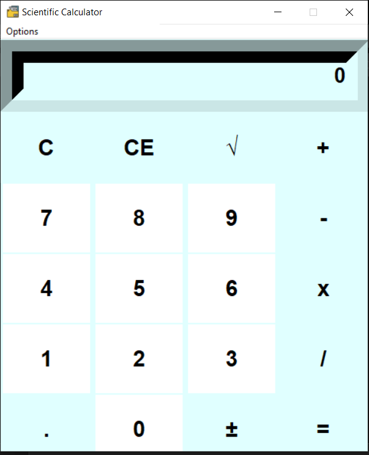
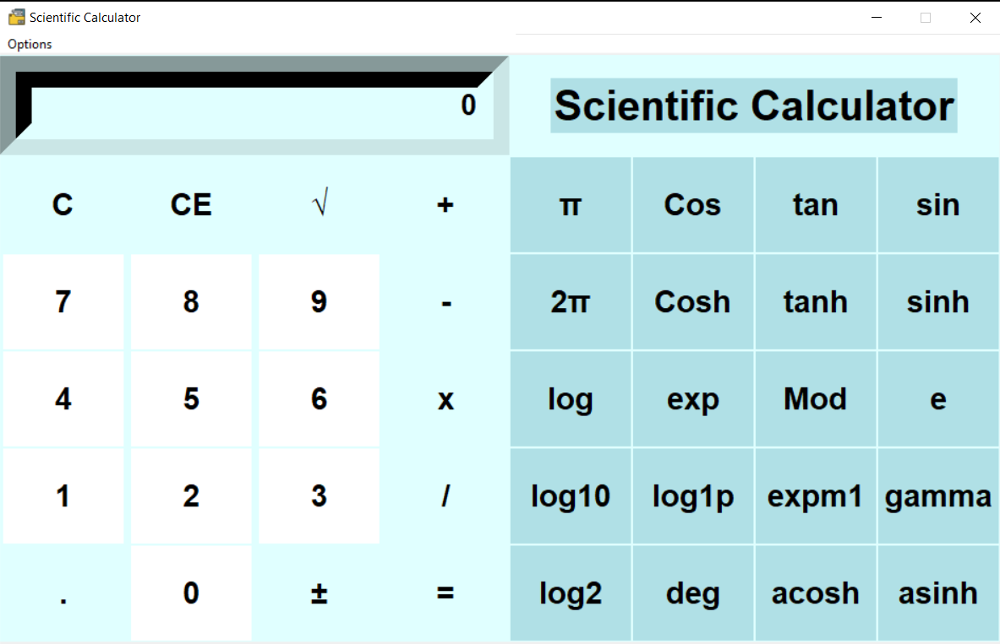

# Scientific-Calculator in python using tkinter library
It is a calculator written in python which can work in two mode:: 
1-Standard Mode 
2-Scientific Mode 
One can use this according to his/her requirement. 
Shortcut keys are also binded with the modes so that user can easily transfer between the two modes. 
Shortcut key for Standard Mode is CTRL + N 
Shortcut key for scientific Mode is ctrl + S 

### **Standard Mode**

### **Scientific Mode**

Suggestions are most welcomed. 
Thank You.. 
